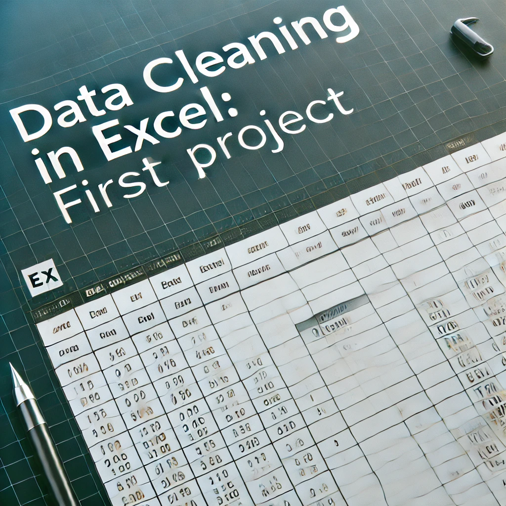
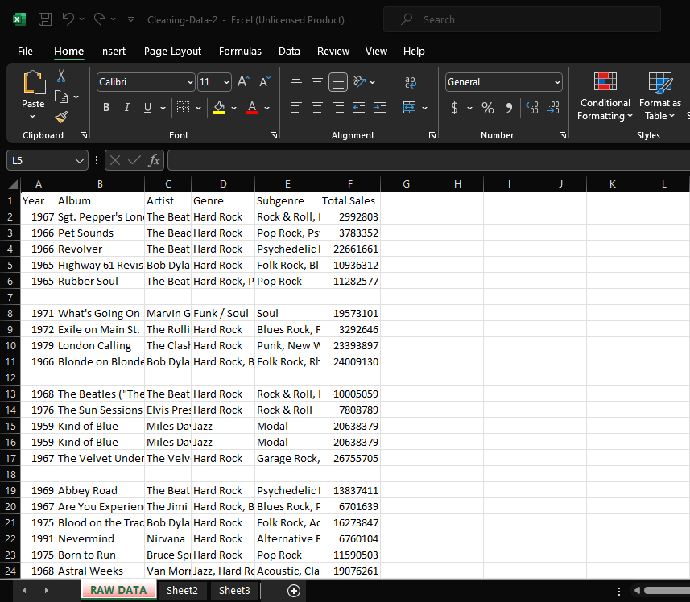

## Data Cleaning Project Using Excel

---

# Introduction 
This is a guided Excel project that showcases a comprehensive data cleaning process aimed at transforming raw, messy datasets into structured and meaningful information. Effective data cleaning ensures accuracy and reliability, setting the foundation for insightful data analysis and visualization.

**_Disclaimer_**: _This dataset does not represent any company or institution. It is rather a dummy data created to show and practice the process of data cleaning and preprocessing._
# Problem Statement
Data in its raw form often contains errors, missing values, inconsistencies, and outliers that hinder proper analysis. This project addresses these issues:
1. How can errors, missing values, and inconsistencies in raw data be effectively addressed?
2. What techniques can be used to identify and treat outliers in datasets?
3. How can cleaned data improve the quality of insights and decision-making?

# Skills Demonstrated
- Data preprocessing and transformation
- Handling missing values and outliers
- Data normalization and formatting
- Identifying and correcting inconsistencies
- Documentation and reporting

# Data Sourcing
The dataset used in this project was sourced from the file provided by my instructor for an Excel crash course on YouTube. The dataset shows the total sales record of albums in the 20th to the 21st century.The raw data contained six columns (Year, Album, Artist, Genre, Subgenre, Total Sales) and 509 rows altogether.

---
_The Raw Dataset_

# Data Cleaning
Before anything could be done, I had to understand the data basically, to know what to correct, erase, delete, add or rearrange. This determined how I carried out my data cleaning process.
Key steps undertaken during the data cleaning phase include:

- Removal of Blank Rows: At first glance, one could see the blank rows present in the dataset. They were removed using the Find & Select icon in the Home ribbon using the Ms Excel 2019 software. This would help to easily highlight all cells and further cleaning can be carried out.
- Clear Formatting: This would clear any formatting present.
- Proper Casing and Spacing: Some cells had too much space either at the front or at the middle of the texts while they were inconsistent in the casing as well.
 Excel's Textual Functions:
  = TRIM()
  = PROPER()
 were applied using a separately inserted column.
  
- Data Standardization: Ensured uniformity in formats for dates, currencies, and categorical values.
- Duplicate Removal: Detected and removed duplicate records. This was done using the Remove Duplicates icon in the Data Tab.
- Inconsistency Resolution: Addressed data entry errors and inconsistencies. There was no missing data.
- Table Formatting: Finally, I converted the whole dataset to a table, using the Format as Table icon in the Home Tab. This aids editing and further analysis of the dataset.

# Data Transformation 
The image below is the dataset after it was properly cleaned and formatted as a table👇

---
_The Cleaned Dataset_

# Conclusion:
The data cleaning process significantly improved the data's quality and usability. The refined dataset would allow for more accurate and reliable analysis.

# Recommendations:
- Implement data validation checks during data collection to reduce errors.
- Automate data cleaning processes to save time and improve efficiency.
- Regularly monitor data quality metrics to maintain data integrity.
